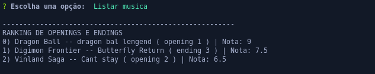

<h1 align="center"> Ranking de Aberturas e Encerramentos de animes </h1>

## Descrição do projeto

<p align=justify>Pequeno projeto cli que trabalha com banco de dados não relacional para a inserção de músicas apresentadas em animações japonesas através de aberturas e encerramento onde usuários se cadastram e podem dar suas notas para cada canção. A aplicação permite o armazenamento dessas notas e as usa para calcular a canção mais bem votada em uma espécia de lista decrescente. </p>

    

### Principais funcionalidades

- Inserir Música.
  - É possível cadastrar músicas por nome;
  - Onde tal canção apareceu: Anime, abertura ou encerramento, em qual ordem ela apareceu. Ex: Primeira abertura (1) ou terceiro encerramento (3);

- Cadastrar usuário
  - Antes que se possa inserir notas a uma ou mais canções é preciso cadastrar um nome de usuário, esse nome será usada para inserir uma nota a canção.

- Editar Canção e usuário.
  - Ambas dados podem serem alterados posteriormente.

- Remover notas e canções.
    - É possível que qualquer usuário remova uma ou mais canções, como não há aqui um tratamento de login é apenas uma aplicação aberta para gravação de notas canções, tais estão permitidas.
    - Atenção: a remoção de uma canção remove todas as suas notas em conjunto.
    - Notas também podem serem removidas, neste caso a canção permanece e somente a nota do usuário cadastrado será removida.
- Listar canções.
    - Canções serão listadas de acordo com suas notas. Das maiores para as menores.

> Status do Projeto: Concluído :heavy_check_mark:




### Como rodar a aplicação

Para executar a aplicação você precisará ter a versão node mais recente e a do docker. Então no terminal do seu computador clone o projeto:

```
git clone git@github.com:Nabucodono5or/rank-opning-log.git
```

Entre na pasta do projeto

```
cd rank-opning-log
```

Antes de executar a aplicação instale as dependências e configure o acesso ao banco de dados:

```
npm install
```
Levante através do docker-compose o arquivo mongo.yml

```
docker-compose -f mongo.yml up
```

Execute a aplicação em modo desenvolvedor
```
npm run dev
```
Ainda não foi testada sua versão em modo de produção, no entanto para os curiosos será necessário tornar o arquivo app.ts em um executável adicionando o comentário <code> #!/bin/bash </code> e usando o npm para torná-lo parte da aplicação.

### Linguagens, dependências e libs utilizadas

- [javascript](https://developer.mozilla.org/en-US/docs/Web/javascript)
- [express](http://expressjs.com/pt-br/)
- [mongodb](https://www.mongodb.com/)
- [mongoose](https://mongoosejs.com/)
- [docker](https://www.docker.com/)
- [inquirerJs](https://github.com/SBoudrias/Inquirer.js/)

### Uso de interface com mongodb
Foi utilizado com o docker compose o mongo-express interface de comunicação com o mongodb através do browser. Para acessar tal link basta user o link que se apresenta nos logs do docker-compose ao executá-lo.


Atenção o arquivo mongo.yml cria um volume persistente do banco de dados, caso não queira sua persistência remova o seguinte trecho do arquivo:

```yml
    volumes:
      - db-openning:/data/db
volumes:
  db-openning:
```

### TODO
Ficam aqui registrados as seguintes pendências:

- [ ] Uma maneira de saída do menu. Até o presente momento foi detectado um erro ao se escolher a opção Sair do menu principal.

- [ ] Melhoria no código para algumas opções. 